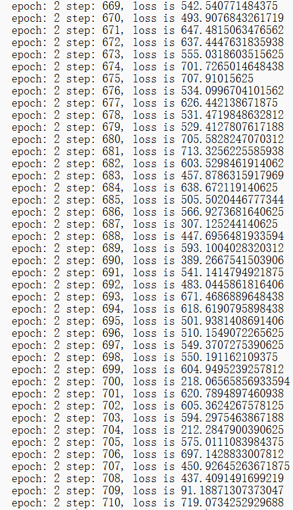
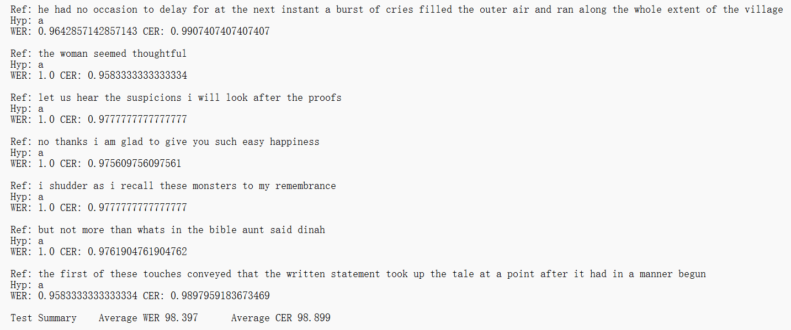

# Speech_Recognition_2022

Tongji University · Class of 2022 · School of Computer Science and Technology · Software Engineering · Machine Intelligence Direction · Speech Recognition Coursework

Teacher: Ying Shen

Semester of instruction: 2024-2025, autumn semester

# Task: DeepSpeech

Build a DeepSpeech2 speech recognition model based on the MindSpore framework.

Explanation of Key Steps and Evaluation Results

**Question**:  
Training one epoch takes 50 hours. How can the program run faster?

# Experiment Overview

## Experiment Background

DeepSpeech2, proposed by Baidu Research, is an end-to-end speech recognition model based on the CTC (Connectionist Temporal Classification) loss function. Unlike traditional manually designed pipelines, DeepSpeech2 uses a neural network to directly learn features from speech signals and generate corresponding text outputs. This model is capable of handling various complex speech scenarios, including noisy environments, different accents, and multiple languages. The introduction of DeepSpeech2 greatly simplifies the development process of speech recognition systems and significantly improves recognition performance.

MindSpore is an open-source deep learning framework developed by Huawei that aims to provide efficient and flexible development experiences. MindSpore supports various hardware platforms, including CPU, GPU, and Ascend, and is suitable for a range of scenarios, from research to production. With MindSpore, developers can quickly build and train deep learning models and achieve efficient inference and deployment.

## Experiment Objectives

- **Familiarize with the MindSpore training process**: Through this experiment, learners will understand how to use MindSpore to build, train, and evaluate models, gaining proficiency in basic usage of MindSpore.
  
- **Familiarize with building and training DeepSpeech2 models using MindSpore**: Learners will deeply understand the architecture of the DeepSpeech2 model and implement its training and evaluation using MindSpore, mastering how to perform end-to-end speech recognition tasks.
  
- **Learn Linux commands**: The experimental platform is based on a Linux environment, allowing learners to become proficient in common Linux commands and enhance their development skills in Linux systems.

## Experiment Environment

- **Platform**: ECS (Cloud Server)
- **Framework**: MindSpore 1.6
- **Hardware**: CPU
- **Software Environment**: Python 3.9.0, MindSpore 1.6

# Experiment Process

## Environment Setup

Purchase ECS resources and log in remotely to set up the development environment.

## Code and Data Download

The `deepspeech2` project code is located in the `models/official/audio/deepspeech2` folder.

Training and inference parameters are in the `config.py` file.

The dataset is the LibriSpeech dataset.
- **Training Set**: train-clean-100: [6.3G] (100 hours of clean speech)
- **Validation Set**: dev-clean.tar.gz [337M] (clean), dev-other.tar.gz [314M] (noisy)
- **Test Set**: test-clean.tar.gz [346M] (clean), test-other.tar.gz [328M] (noisy)

## Data Preprocessing

### Preparation

1. Install Python 3.9.0.
2. Install MindSpore and required dependencies.
3. Download the data preprocessing script from `SeanNaren`.

### LibriSpeech Data Preprocessing

1. Upload the local dataset to the MobaXterm server and modify the path.
2. Run the preprocessing script with the following command:
    ```bash
    python librispeech.py
    ```
3. Convert `json` files to `csv` files: Create a file `json_to_csv.py` under the `deepspeech.pytorch` directory and copy the code there.

## Model Training and Evaluation

### Model Training

1. Create a `deepspeech_pytorch` directory under the `DeepSpeech2` directory and create a `decoder.py` file there.
2. Modify the `config.py` file under the `src` directory:
    - Set `batch_size` to 1 (the batch size depends on the server's performance).
    - Set `epochs` to 1 (approximately 48 hours, adjustable).
    - Set `train_manifest` to the actual path of `libri_train_manifest.csv`.
    - Set `test_manifest` to the actual path of `libri_test_clean_manifest.csv`.
    - Change the window type in `eval_config` from `hanning` to `hann`.
3. Install Python dependencies and download the pretrained model with the following command:
    ```bash
    wget https://ascend-professional-construction-dataset.obs.cn-north-4.myhuaweicloud.com/ASR/DeepSpeech.ckpt
    ```
4. Modify the training start script in the `scripts` directory (`run_standalone_train_cpu.sh`) to load the pretrained model:
    ```bash
    PATH_CHECKPOINT=$1
    python ./train.py --device_target 'CPU' --pre_trained_model_path $PATH_CHECKPOINT
    ```
5. Run the model training in the `DeepSpeech2` directory with the following command:
    ```bash
    bash scripts/run_standalone_train_cpu.sh PATH_CHECKPOINT
    # PATH_CHECKPOINT is the pretrained model path
    ```

    Or run it in the background:
    ```bash
    nohup bash scripts/run_standalone_train_cpu.sh '/home/work/models/official/audio/DeepSpeech2/DeepSpeech.ckpt' > train.log 2>&1 &
    ```

6. View the training log in the current directory (`train.log`):
    ```bash
    tail -f train.log
    ```
    

### Model Evaluation

1. To evaluate the model:
    ```bash
    # Evaluate on CPU
    bash scripts/run_eval_cpu.sh [PATH_CHECKPOINT]
    # [PATH_CHECKPOINT] is the model checkpoint file
    # Example:
    bash scripts/run_eval_cpu.sh ./checkpoint/ DeepSpeech-1_140.ckpt
    ```
2. View the evaluation log:
    ```bash
    tail -f eval.log
    ```
3. Model export: Modify the `export.py` code as follows:
    ```bash
    config = train_config
    context.set_context(mode=context.GRAPH_MODE, device_target="CPU", save_graphs=False)
    with open(config.DataConfig.labels_path) as label_file:
    labels = json.load(label_file)
    ```
    
    
4. Convert and export the model file:
    ```bash
    python export.py --pre_trained_model_path  ./ checkpoint/ DeepSpeech-1_856.ckpt
    ```

# Answer to the Question:

**Training one epoch takes 50 hours. How can the program run faster?**

To speed up the training process, consider the following optimizations:

## **Hardware Optimizations**
1. **Upgrade Hardware**:
   - Use higher-performance hardware such as GPUs (e.g., NVIDIA V100/A100) or AI-specific chips (e.g., Ascend 910). CPUs have limited performance, especially in deep learning tasks, and GPUs or specialized chips can significantly reduce training time.
   - Consider using distributed training across multiple servers to maximize hardware resources.

2. **Cloud Platform Optimizations**:
   - Use cloud platforms that support GPUs or TPUs (e.g., Huawei Cloud, AWS, Google Cloud) to run the task.
   - Choose more powerful computing instances based on your budget.


## **Software and Algorithm Optimizations**
1. **Adjust Batch Size**:
   - Increase the `batch_size` to process more data at once, reducing the number of iterations.
   - Ensure that the batch size is balanced with memory consumption to avoid overflow.

2. **Optimize Data Loading**:
   - Use multithreading or asynchronous data loading (e.g., MindSpore's `DataLoader` provides parallel features).
   - Ensure that data preprocessing (e.g., data augmentation, decoding) is not a bottleneck.

3. **Mixed-Precision Training**:
   - Enable mixed precision (FP16 and FP32) to speed up floating-point computations using hardware support.
   - MindSpore provides the `mindspore.amp` module to support mixed-precision training.

4. **Use Transfer Learning**:
   - Start training from a pretrained model (e.g., DeepSpeech2's open-source pretrained weights) and only update the last few layers, reducing computational load.

5. **Model Pruning and Distillation**:
   - Prune redundant network weights (model pruning).
   - Use knowledge distillation with a smaller student model to learn.

6. **Optimizer and Learning Rate Adjustments**:
   - Use faster-converging optimizers (e.g., Adam, LAMB).
   - Set up a dynamic learning rate scheduler to adjust the learning rate during training.


## **Reduce Data Size**
1. **Simplify the Dataset**:
   - Use a subset of the dataset (e.g., the train-clean-100 dataset) and improve performance through transfer learning.
   - Data augmentation: Apply transformations (e.g., time-stretching, volume adjustments) to increase variability.

2. **Reduce Epochs or Use Early Stopping**:
   - Adjust the training strategy to reduce unnecessary epochs and stop training early based on validation set performance.
