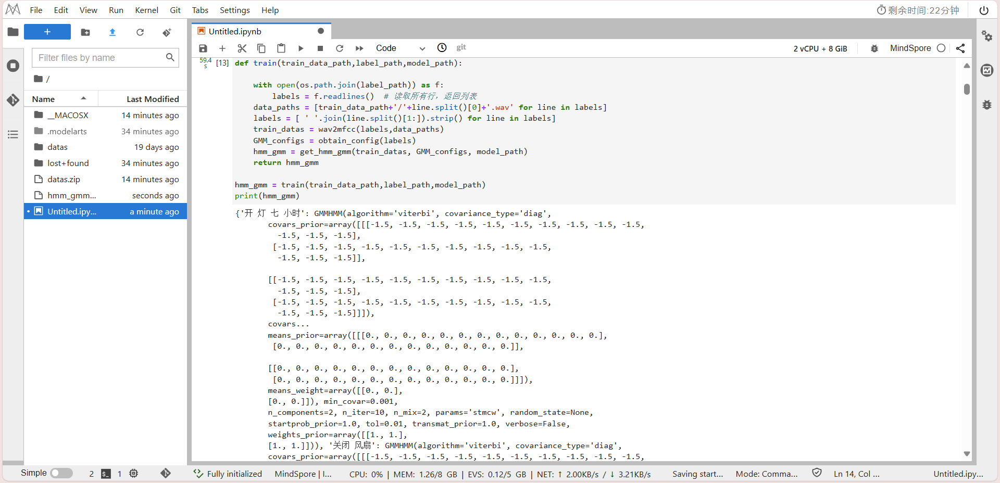

# 语音识别

同济大学 2022级 计算机科学与技术学院 软件工程专业 机器智能方向 语音识别课程作业

授课教师：沈莹

授课学期：2024-2025年度 秋季学期

# 任务: GMM-HMM

1. 参考实验手册，提交实验报告，同时把自己第一次作业提取的特征作为输入，观察识别结果。

2. 使用最大似然估计方法，估计多元高斯模型中均值参数 \(\mu\)，给定一组采样数据 \(X = \{x_1, x_2, \dots, x_n\}\)。

**多元高斯模型的概率密度函数：**

\[
p(x|\mu, \Sigma) = \frac{1}{(2\pi)^{D/2} |\Sigma|^{1/2}} e^{-\frac{1}{2}(x-\mu)^T\Sigma^{-1}(x-\mu)}
\]

**参数说明**
- \(D\)：数据的维度
- \(|\Sigma|\)：协方差矩阵 \(\Sigma\) 的行列式

## GMM-HMM

在实验中，学生登录华为云官网，在华为提供的MindSpore平台和给定数据集上运行基于GMM-HMM的连续词语音识别代码并识别出测试音频中的文字内容。

### 实验步骤

#### 环境准备
1. 进入华为云ModelArts控制台
2. 创建Notebook训练作业
3. 启动Notebook进入开发环境

#### 数据准备
1. 将数据上传到服务器：
   - 将datas.zip数据上传到服务器
   - 打开终端输入：unzip datas.zip
2. 执行安装python库命令
    ```python
    pip install python_speech_features
    pip install hmmlearn
    ```
    
3. 导入所需库
4. 配置路径
5. 定义特征提取函数
6. 定义高斯混合模型的配置信息


#### 创建模型并进行训练和测试
1. 创建GMM-HMM模型
   
2. 读取训练数据并训练模型
   
3. 调用测试
   

具体代码及输出在 **GMM-HMM.ipynb** 文件中，库函数输出的特征值保存在 **hmm_gmm_model.pkl** 文件中。

### 把自己第一次作业提取的特征作为输入

#### 实验现象
将自己第一次作业提取的特征保存到 **feature.pkl** 文件中，详细代码在 **MFCC_Extraction.ipynb**文件中。


具体代码及输出在 **mineGMM-HMM.ipynb** 文件中。

## 最大似然估计步骤

### 1. 似然函数

假设我们有 \(n\) 个样本数据点 \( x_1, x_2, ..., x_n \)，则联合似然函数是每个数据点的概率密度函数的乘积：

\[
L(\mu | X) = \prod_{i=1}^{n} p(x_i | \mu, \Sigma)
\]

### 2. 对数似然函数

为了简化计算，通常取似然函数的对数，得到对数似然函数：

\[
\log L(\mu | X) = \sum_{i=1}^{n} \log p(x_i | \mu, \Sigma)
\]

代入多元高斯分布的概率密度函数形式：

\[
\log L(\mu | X) = -\frac{n}{2} \log(2\pi) - \frac{n}{2} \log |\Sigma| - \frac{1}{2} \sum_{i=1}^{n} (x_i - \mu)^\top \Sigma^{-1} (x_i - \mu)
\]

### 3. 对 \( \mu \) 求导

为了最大化对数似然函数，我们对 \( \mu \) 进行求导，并令导数为零：

\[
\frac{\partial}{\partial \mu} \log L(\mu | X) = \frac{\partial}{\partial \mu} \left( - \frac{1}{2} \sum_{i=1}^{n} (x_i - \mu)^\top \Sigma^{-1} (x_i - \mu) \right)
\]

由于 \( \Sigma \) 是常数矩阵，求导后得到：

\[
\frac{\partial}{\partial \mu} \log L(\mu | X) = \Sigma^{-1} \sum_{i=1}^{n} (x_i - \mu)
\]

令导数等于零，解得：

\[
\sum_{i=1}^{n} (x_i - \mu) = 0
\]

即：

\[
\mu = \frac{1}{n} \sum_{i=1}^{n} x_i
\]

### 4. 最终结果

因此，使用最大似然估计法估计均值 \( \mu \) 为样本数据的均值：

\[
\hat{\mu} = \frac{1}{n} \sum_{i=1}^{n} x_i
\]
