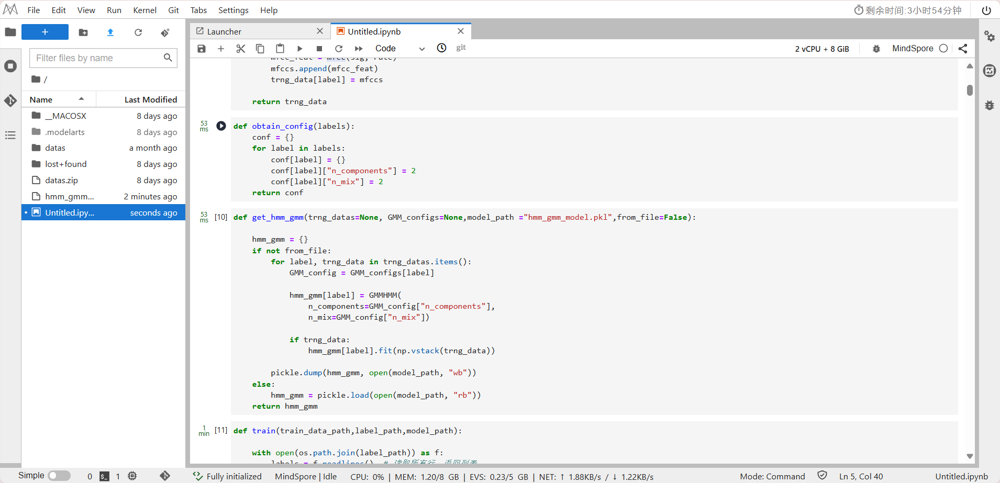
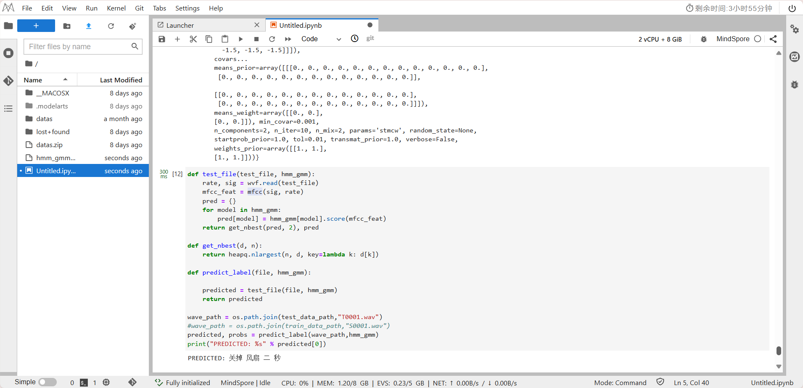

# Speech_Recognition_2022

Tongji University · Class of 2022 · School of Computer Science and Technology · Software Engineering · Machine Intelligence Direction · Speech Recognition Coursework

Teacher: Ying Shen

Semester of instruction: 2024-2025, autumn semester

# Task: GMM-HMM

1. Refer to the lab manual and submit a lab report while using the features extracted from your first assignment as input and observing the recognition results.

2. Estimation of mean parameters in multivariate Gaussian models using maximum likelihood estimation methods \(\mu\). Given a set of sampling data \(X = \{x_1, x_2, \dots, x_n\}\)。

**Probability density functions for multivariate Gaussian models：**

\[
p(x|\mu, \Sigma) = \frac{1}{(2\pi)^{D/2} |\Sigma|^{1/2}} e^{-\frac{1}{2}(x-\mu)^T\Sigma^{-1}(x-\mu)}
\]

**Parameter description**
- \(D\)：Dimensions of the data
- \(|\Sigma|\)：covariance matrix \(\Sigma\) determinant of a function

## GMM-HMM

In the experiment, students logged into the Huawei Cloud website, ran the GMM-HMM based continuous word speech recognition code on the MindSpore platform and given dataset provided by Huawei and recognised the textual content in the test audio.

### Experimental Steps
#### Environment Setup
1. **Access Huawei Cloud ModelArts Console**: Log into your Huawei Cloud account, visit the Huawei Cloud website, and access the ModelArts console.
2. **Create a Notebook Training Job**: In the console, select "Notebook" > "Create Notebook" > Configure the training job and select the appropriate computing resources (here, choose the basic 2-core + 8GB setup).
3. **Start the Notebook and Enter Development Environment**: After creating the notebook, start it and enter the development environment where the subsequent code training and testing will be executed.

#### 数据准备
1. **Upload Data to Server**: 
   - Upload the `datas.zip` file to the server.
   - Open the terminal and run: `unzip datas.zip`.
2. **Install Required Python Libraries**:
    ```python
    pip install python_speech_features
    pip install hmmlearn
    ```
    
3. **Import Necessary Libraries**: In the notebook, import the necessary libraries, including those for feature extraction and model training.
4. **Configure Paths**: Configure the paths for the audio files and data storage.
5. **Define Feature Extraction Function**: Use MFCC (Mel-frequency cepstral coefficients) as the feature extraction method to convert the audio data into MFCC features.
6. **Define Gaussian Mixture Model (GMM) Configuration**: Using a combination of HMM (Hidden Markov Model) and GMM, define the model parameters and initialize the GMM-HMM model.
    

#### Model Creation, Training, and Testing
1. **Create the GMM-HMM Model**:
    
2. **Read Training Data and Train the Model**:
    
3. **Test the Model**:
    

The complete code and output are in the **GMM-HMM.ipynb** file, and the feature values generated by the library functions are saved in the **hmm_gmm_model.pkl** file.

### Using Features Extracted from Your First Assignment as Input

#### Experimental Observations
The features extracted from your first assignment are saved in the **features.npy** file, and the detailed code is in the **MFCC_Extraction.ipynb** file.

The extracted features include:

- The MFCC features of the audio.
- The standardized and processed feature vectors.

  
  
  


The complete code and output are in the **mineGMM-HMM.ipynb** file.

In the **mineGMM-HMM.ipynb** file, we use these features as inputs to train and test the model. The final output shows that the recognition effect using custom feature extraction is comparable to that of the platform-provided features, validating the feasibility and effectiveness of the custom feature extraction method.

### Summary

Through comparison and analysis of the output results, we found that the features we extracted were very close to those returned by the platform's interface. This confirms the correctness of our feature extraction and model training process. In the case of minor differences, we can further optimize the feature extraction details (e.g., adjusting MFCC parameters or using more training data) to improve recognition accuracy.

## Maximum Likelihood Estimation Steps

### 1. Likelihood Function

Suppose we have \(n\) sample data points \( x_1, x_2, ..., x_n \), the joint likelihood function is the product of the probability density function of each data point:

\[
L(\mu | X) = \prod_{i=1}^{n} p(x_i | \mu, \Sigma)
\]

### 2. Log-Likelihood Function

To simplify the calculation, we usually take the logarithm of the likelihood function to get the log-likelihood function:

\[
\log L(\mu | X) = \sum_{i=1}^{n} \log p(x_i | \mu, \Sigma)
\]

Substituting the probability density function of a multivariate Gaussian distribution:

\[
\log L(\mu | X) = -\frac{n}{2} \log(2\pi) - \frac{n}{2} \log |\Sigma| - \frac{1}{2} \sum_{i=1}^{n} (x_i - \mu)^\top \Sigma^{-1} (x_i - \mu)
\]

### 3. Derivative with Respect to \( \mu \)

To maximize the log-likelihood function, we take the derivative with respect to \( \mu \) and set it to zero:

\[
\frac{\partial}{\partial \mu} \log L(\mu | X) = \frac{\partial}{\partial \mu} \left( - \frac{1}{2} \sum_{i=1}^{n} (x_i - \mu)^\top \Sigma^{-1} (x_i - \mu) \right)
\]

Since \( \Sigma \) is a constant matrix, after differentiating, we get:

\[
\frac{\partial}{\partial \mu} \log L(\mu | X) = \Sigma^{-1} \sum_{i=1}^{n} (x_i - \mu)
\]

Setting the derivative equal to zero, we solve for \( \mu \):

\[
\sum_{i=1}^{n} (x_i - \mu) = 0
\]

Thus:

\[
\mu = \frac{1}{n} \sum_{i=1}^{n} x_i
\]

### 4. Final Result

Therefore, the maximum likelihood estimate for the mean \( \mu \) is the sample mean:

\[
\hat{\mu} = \frac{1}{n} \sum_{i=1}^{n} x_i
\]
