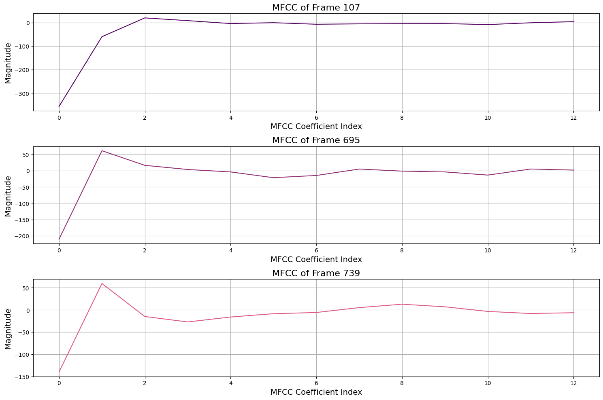

# 语音识别

同济大学 2022级 计算机科学与技术学院 软件工程专业 机器智能方向 语音识别课程作业

授课教师：沈莹

授课学期：2024-2025年度 秋季学期

# 任务: MFCC Extraction

提取语音片段的声学特征（MFCC）。正确注释您的代码。

处理步骤包括

- 预加重
- 窗函数
- STFT
- 梅尔滤波器组
- 对数()
- DCT
- 动态特征提取
- 特征变换

将您的结果与 Python 软件包提供的 MFCC 函数输出结果进行比较。 请在报告中说明造成差异的可能原因。

上传代码和报告。

# 综述

本报告阐述了MFCC（梅尔频率倒谱系数）声学特征从语音段中的提取过程。我们将依次探讨以下步骤：预加重、窗口化、短时傅里叶变换、梅尔滤波器组、取对数、离散余弦变换、动态特征提取和特征转换，并附带相关图形输出，如频谱图和MFCC。通过详细分析每个步骤的实现与效果，我们将揭示MFCC提取在语音处理中的重要性及其在实际应用中的潜在影响。

# 导入包并加载音频

在这一部分，我们将导入所需的库，并加载音频文件以进行后续处理。以下是具体的步骤：

1. 导入必要的库：

- `librosa`：用于音频处理，包括加载音频文件和提取特征。
- `numpy`：用于数值计算和数组操作。
- `matplotlib`：用于数据可视化，帮助展示音频信号的波形和频谱。

2. 加载音频文件：使用 `librosa.load()` 函数加载指定的音频文件，这将返回音频信号和采样率。


# 预加重

在音频信号处理的过程中，预加重是一种重要的信号增强技术，旨在提高信号的高频成分，以补偿在后续处理步骤中可能出现的高频损失。

在本实验中，预加重通过 `pre_emphasis` 函数实现，该函数接受输入音频信号和一个预加重系数（默认为0.98）作为参数。预加重的核心思想是对当前样本与前一个样本的差值进行加权，公式如下：
\[ 
\text{emphasized\_signal}[n] = \text{signal}[n] - \alpha \times \text{signal}[n-1] 
\]

其中，\(\alpha\) 控制高频增强的程度。通过这种方式，信号的高频部分得到了强化，有助于在后续的短时傅里叶变换和梅尔滤波器处理时更好地捕捉到频谱特征。

在代码的后半部分，预加重后的信号与原始信号进行了比较。通过可视化波形和频谱，可以观察到预加重后的信号在高频区域的幅度明显提高，这表明预加重成功地增强了信号的高频成分。此外，代码还计算并打印了原始信号和预加重信号的均值和标准差，以量化它们的统计特性。


# Windowing

在音频信号处理中，窗函数（Windowing）是一种常用的技术，用于将连续信号分成重叠的帧，以便进行后续的频域分析，如短时傅里叶变换（STFT）。窗函数的主要目的是减小由于信号截断而导致的频谱泄漏现象，从而提高频域特征的准确性和解析度。

1. 帧分割：首先，输入的音频信号被分割成若干个重叠的帧。每一帧的长度由 `frame_size` 决定，而每两帧之间的时间间隔由 `frame_stride` 控制。这种重叠的设计可以确保信号中重要的频率信息不会因帧的截断而丢失。

2. 窗函数选择：在本代码中，选择了汉明窗（Hamming Window）作为窗函数。汉明窗是一种平滑的窗函数，可以有效地减小频谱泄漏现象。其数学表达式为：

\[
w[n] = 0.54 - 0.46 \cdot \cos\left(\frac{2\pi n}{N-1}\right) \quad (0 \leq n < N)
\]


其中，$N$ 是窗的长度，$n$ 是当前样本的索引。

3. 应用窗函数：通过将窗函数与每帧的信号相乘，得到加窗后的信号。具体代码实现如下：

```pyhon
window = np.hamming(frame_length)
frames_windowed = frames * window
```

4. 可视化比较：代码中还通过可视化展示了应用窗函数前后帧信号的差异。通过对比未加窗和加窗后的帧信号，可以观察到加窗后信号的波形更平滑，从而减小了频谱泄漏。
   


# Short-Time Fourier Transform (STFT)

在音频信号处理中，短时傅里叶变换（STFT）是一种用于分析信号频谱随时间变化的方法。STFT通过将信号分割成小的、重叠的时间段（帧），然后对每一帧应用傅里叶变换，来实现这一目的。这种方法能够捕捉到信号的时间和频率特性，适用于非平稳信号（如语音和音乐）分析。

1. 计算幅度谱：使用np.fft.rfft函数对每个帧进行快速傅里叶变换（FFT），获得每个帧的幅度谱。幅度谱表示信号在不同频率上的强度，具体代码如下：

```python
mag_frames = np.abs(np.fft.rfft(frames, NFFT))
```

2. 计算功率谱：将幅度谱平方并归一化，得到功率谱。功率谱显示了频率成分的能量分布，有助于了解信号的能量特性：

```python
pow_frames = ((1.0 / NFFT) * (mag_frames ** 2))
```

3. 频率分辨率设置：NFFT参数决定了傅里叶变换的点数，从而影响频率分辨率。较大的NFFT值将提供更高的频率分辨率。

4. 可视化频谱：代码中通过随机选择的帧绘制了幅度谱图和3D谱图，以直观展示每帧的频谱特征。每个图表展示了在不同频率下的信号强度，帮助分析信号在时间和频率域的变化。

5. 3D谱图：最后，使用3D图形展示了整个信号的STFT结果，通过将幅度谱转换为分贝（dB）尺度，能够更清晰地观察到不同频率成分随时间的变化。这种三维可视化提供了一个直观的方式来理解音频信号的频率内容。


# Mel-filter Bank

在音频信号处理中，梅尔滤波器组（Mel Filter Bank）是一种重要的工具，用于将频谱转换到梅尔频率尺度，以更好地模拟人耳对声音的感知特性。梅尔滤波器组由多个三角形滤波器组成，每个滤波器在特定频率范围内对输入信号进行加权，从而提取与人耳听觉相关的频率特征。

1. 梅尔尺度转换：代码首先将低频和高频转换为梅尔尺度。梅尔尺度是一种对数尺度，通常用于音频处理，以匹配人耳对频率的感知：

```python
low_freq_mel = 0
high_freq_mel = 2595 * np.log10(1 + (fs / 2) / 700)
```

2. 生成梅尔点：通过在梅尔尺度上均匀分布生成梅尔点，然后将这些梅尔点转换回赫兹（Hz）单位：

```python
mel_points = np.linspace(low_freq_mel, high_freq_mel, num_filters + 2)
hz_points = 700 * (10 ** (mel_points / 2595) - 1)
```
3. FFT频率与滤波器索引的映射：计算对应的FFT频率点，以便后续构建滤波器：

```python
bin_points = np.floor((NFFT + 1) * hz_points / fs)
```

4. 构建三角形滤波器：创建一个二维数组来表示滤波器组。通过在相邻的梅尔点之间构建三角形滤波器，具体实现如下：

```python
for m in range(1, num_filters + 1):
    f_m_minus = int(bin_points[m - 1])
    f_m = int(bin_points[m])
    f_m_plus = int(bin_points[m + 1])
    # Construct the left and right sides of the triangular filter
```

5. 应用梅尔滤波器：将梅尔滤波器组应用到频谱上，生成梅尔谱。梅尔谱是将每个频谱特征加权并求和得到的，反映了信号在梅尔频率尺度上的能量分布：

```python
mel_spectrum = np.dot(spectrum, filters.T)
```

6. 可视化梅尔滤波器组：代码中绘制了梅尔滤波器组的响应，展示了每个滤波器在频率域的形状。这有助于理解每个滤波器对输入信号的加权效果。

7. 3D可视化：通过3D图形展示梅尔谱和梅尔滤波器响应，直观地呈现音频信号的梅尔频率特征和时域变化。


# Log Transformation

在音频信号处理和特征提取过程中，对数变换（Log Transformation）是一种常用的方法，用于模拟人类听觉系统对声音强度的感知特性。通过对数变换，可以将音频信号的动态范围压缩，从而使得较低幅度的声音更易于处理和分析。

1. 定义对数变换函数：log_magnitude函数接受输入谱（例如梅尔谱），并将其转换为对数尺度。具体实现如下：

```python
return 10 * np.log10(x)
```
该函数通过对输入信号取10的对数，将其转换为分贝（dB）尺度。此转换能够有效地压缩较大的幅度差异，使得较小的幅度变化变得更加显著。

2. 应用对数变换：将对数变换应用于梅尔谱，生成对数梅尔谱：

```python
log_mel_spectrum = log_magnitude(mel_spectrum)
```

3. 可视化对数梅尔谱：代码中通过3D图形和随机帧的二维图形展示了对数梅尔谱。3D图形直观地展示了每个梅尔滤波器在时间和频率上的强度变化。可视化部分的实现如下：

```python
ax.plot_surface(time_mesh, mel_mesh, log_mel_spectrum_dB, cmap=custom_cmap, edgecolor='none')
```

4. 随机帧的绘制：还通过随机选择的几帧对数梅尔谱进行绘制，便于观察特定帧的频谱特征：

```python
plt.plot(log_mel_spectrum[frame_idx], color=custom_colors[i % len(custom_colors)])
```


# Discrete Cosine Transform (DCT)

在音频信号处理和特征提取中，离散余弦变换（Discrete Cosine Transform, DCT）是一种重要的工具，常用于将信号从时间域或频率域转换为更紧凑的频域表示。DCT在许多应用中发挥着重要作用，包括语音识别、音频编码和图像压缩。

1. 计算DCT：通过调用dct函数对对数梅尔谱进行DCT变换。具体实现如下：
```python
mfcc_features = dct(log_mel_spectrum, type=2, axis=1, norm='ortho')[:, :13]
```
这里，type=2表示进行标准的DCT变换，axis=1指定沿着行（每个时间帧）的方向进行变换，norm='ortho'表示使用正交归一化。此操作将对数梅尔谱的每一帧转换为MFCC特征，提取出其主要频率成分。

2. 提取MFCC系数：代码中选取了DCT变换的前13个系数，通常这些系数能够最有效地表示信号的特征。MFCC的提取步骤如下：
```python
mfcc_features = dct(log_mel_spectrum, type=2, axis=1, norm='ortho')[:, :13]
```

3. 可视化MFCC特征：代码中使用3D图形展示了提取的MFCC特征。在3D图中，x轴表示帧索引，y轴表示MFCC系数索引，z轴表示每个系数的幅度。通过这种方式，可以直观地观察MFCC特征在时间和频率上的变化：
```python
ax.plot_surface(time_mesh, mfcc_mesh, mfcc_features_3d, cmap=custom_cmap, edgecolor='none')
```

4. 随机帧的绘制：通过随机选择的几帧MFCC特征进行二维绘制，便于观察特定帧的特征表现。这部分代码如下：
```python
plt.plot(mfcc_features[frame_idx], color=custom_colors[i % len(custom_colors)])
```




# Dynamic Feature Extraction

在音频信号处理和特征提取中，动态特征提取（Dynamic Feature Extraction）是指计算音频特征（如MFCC）在时间上的变化，以捕捉信号的动态特性。这种动态特征通常包括一阶导数（Delta）和二阶导数（Delta-Delta），用于反映特征随时间的变化趋势。

1. 计算一阶导数（Delta）：
使用delta函数计算MFCC特征的一阶导数，反映每个MFCC系数在时间上的变化。具体实现如下：
```python
delta1 = delta(mfcc_features)
```
一阶导数的计算涉及对输入特征矩阵进行加权求和，以评估特征值的变化率。代码中的N参数指定了计算导数时的窗口大小。

2. 计算二阶导数（Delta-Delta）：
在获得一阶导数后，进一步计算二阶导数（Delta-Delta），用于捕捉特征变化的加速度。这一步骤通过再次调用delta函数实现：
```python
delta2 = delta(delta1)
```

3. 可视化动态特征：
代码通过3D图形展示了一阶导数（Delta MFCC）和二阶导数（Delta-Delta MFCC）。在3D图中，x轴表示帧索引，y轴表示MFCC系数索引，z轴表示每个系数的幅度。通过这种方式，可以直观地观察动态特征在时间和频率上的变化：
```python
ax.plot_surface(time_mesh, mfcc_mesh, delta1_3d, cmap=custom_cmap, edgecolor='none')
```

4. 随机帧的绘制：
通过随机选择的几帧动态特征进行二维绘制，便于观察特定帧的动态表现：
```python
plt.plot(delta1[frame_idx], color=custom_colors[i % len(custom_colors)])
```


# Feature Transformation

在音频信号处理和特征提取过程中，特征变换（Feature Transformation）是一个关键步骤，旨在对提取的特征进行处理，以提高模型的性能和稳定性。特征变换通常包括特征组合、均值归一化和方差归一化等操作。

1. 特征堆叠：将MFCC特征、一阶导数（Delta）和二阶导数（Delta-Delta）特征水平堆叠在一起，形成一个新的特征集。这一步骤通过np.hstack函数实现：
```python
stacked_features = np.hstack((mfcc_features, delta1, delta2))
```
通过将这三类特征合并，模型能够更全面地捕捉音频信号的时域和频域特征。

2. 均值归一化（Mean Normalization）：对合并后的特征集进行均值归一化，即从每个特征中减去其在所有帧上的均值。这一过程可以消除不同特征之间的偏移，使得特征的中心位置接近零，公式为：
```python
cmn_features = stacked_features - np.mean(stacked_features, axis=0)
```
均值归一化有助于提高模型的训练速度和收敛性，避免某些特征的偏移影响学习效果。

3. 方差归一化（Variance Normalization）：接下来，对均值归一化后的特征进行方差归一化，将每个特征除以其标准差。具体实现如下：
```python
cvn_features = cmn_features / np.std(cmn_features, axis=0)
```
方差归一化确保每个特征的尺度相同，使得特征在相同的范围内波动（通常是[-1, 1]），这对于模型训练尤其重要，因为不同尺度的特征可能导致优化算法的效率降低。

4. 可视化特征：代码中通过3D图形展示了归一化后的特征集。该图展示了时间帧和特征索引（MFCC、Delta和Delta-Delta）之间的关系，使得我们能够直观观察特征的变化情况：
```python
ax.plot_surface(time_mesh, feature_mesh, cvn_features_3d, cmap=custom_cmap, edgecolor='none')
```

5. 打印特征信息：代码还输出了归一化特征矩阵的形状以及某个特定帧的特征值，方便分析和调试：
```python
print('CVN Features Shape:', cvn_features.shape)
```


# Principal Component Analysis (PCA)

主成分分析（Principal Component Analysis, PCA）是一种常用的降维技术，通过线性变换将高维数据转换到低维空间，以捕捉数据中最重要的变异性。在音频信号处理和特征提取的上下文中，PCA有助于减少特征的维度，同时保留大部分信息，这对于后续的模型训练和分析非常重要。

1. 初始化PCA：使用PCA类初始化一个PCA模型，设置要保留的主成分数量（n_components），即选择要保留的特征维度：
```python
pca = PCA(n_components=n_components)
```
2. 拟合PCA模型并转换数据：
通过调用fit_transform方法，PCA模型会根据输入的特征集（如MFCC、Delta、Delta-Delta的组合特征）进行拟合，并返回转换后的特征数据：
```python
transformed_features = pca.fit_transform(features)
```

3. 可视化PCA组件：代码使用热图展示每个主成分的变化情况。每个PCA组件的幅度被绘制在图中，x轴表示帧索引，y轴表示不同的主成分：

```python
plt.imshow(transformed_features[:, i].reshape(-1, 1).T, aspect='auto', cmap=custom_cmap, origin='lower')
```

4. 解释方差比：PCA还提供了每个主成分的解释方差比，表示每个成分在保留原始数据变异性方面的贡献。通过以下代码可以打印出每个主成分的方差比：
```python
explained_variance = pca_model.explained_variance_ratio_
```

5. 打印PCA组件特征向量：PCA模型的components_属性包含了每个主成分的特征向量，显示了如何从原始特征空间组合形成新的主成分：
```python
print(pca_model.components_)
```

4. 打印特定帧的转换特征：代码还输出了某个特定帧（例如帧10）的PCA转换特征，便于分析和调试：
```python
print(transformed_features[frame_number])
```


# Comparison with `librosa` MFCC

在音频信号处理和特征提取的过程中，比较自定义的 MFCC 实现与使用流行库 librosa 计算的MFCC特征是一个重要的步骤。通过这种比较，可以验证自定义实现的准确性和有效性，确保所提取特征的质量适合后续的分析和建模。

1. 计算跳步长度：根据帧步长和采样率计算跳步长度（hop length），该值用于确定每帧之间的间隔

2. 使用 librosa 计算 MFCC ：利用 librosa.feature.mfcc 函数直接从原始信号中计算MFCC特征。此函数的参数包括采样率、FFT点数、跳步长度和梅尔滤波器的数量。

3. 形状匹配：为确保自定义 MFCC 特征与 librosa 计算的 MFCC 特征形状一致，代码检查它们的形状，并根据需要进行修剪或填充。这一过程保证了后续比较时两者的维度相同。
   
4. 可视化比较：通过热图可视化自定义 MFCC 和 librosa MFCC ，便于直观比较这两种方法的输出。热图的x轴表示帧索引，y轴表示 MFCC 系数，颜色强度表示幅度（以分贝为单位）。

5. 结果分析：通过可视化的结果，可以观察到自定义 MFCC 与 librosa MFCC 在幅度、特征表现和时间变化上的相似性或差异。这有助于分析自定义实现的有效性，判断是否需要进一步的调整或优化。

