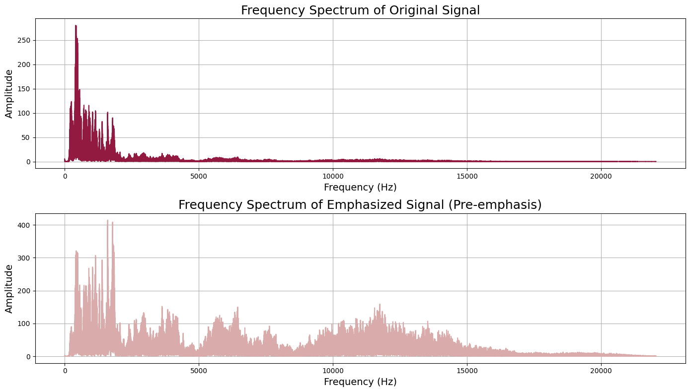
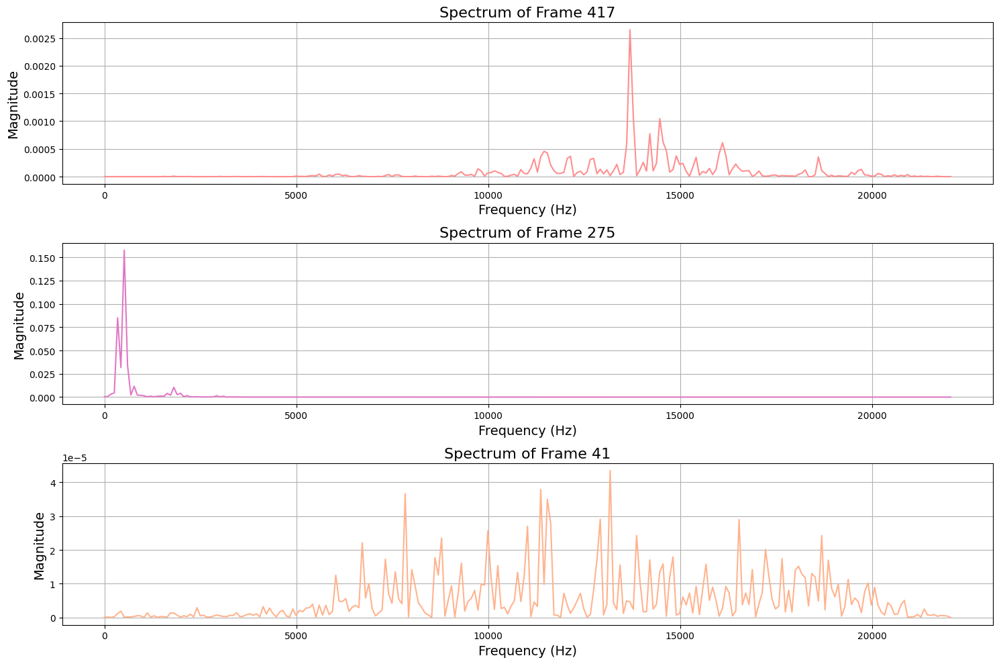
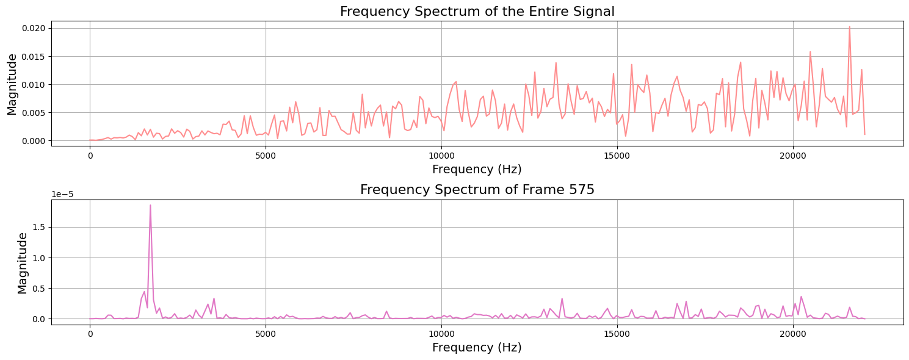
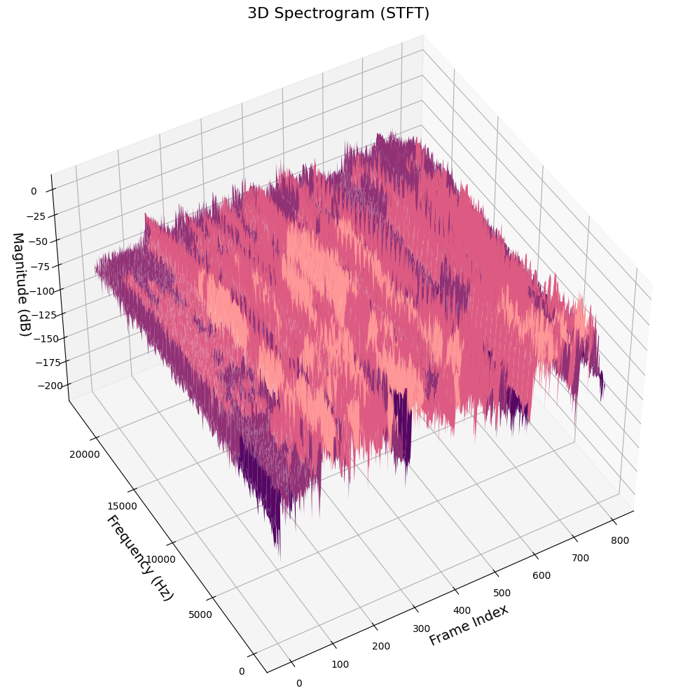
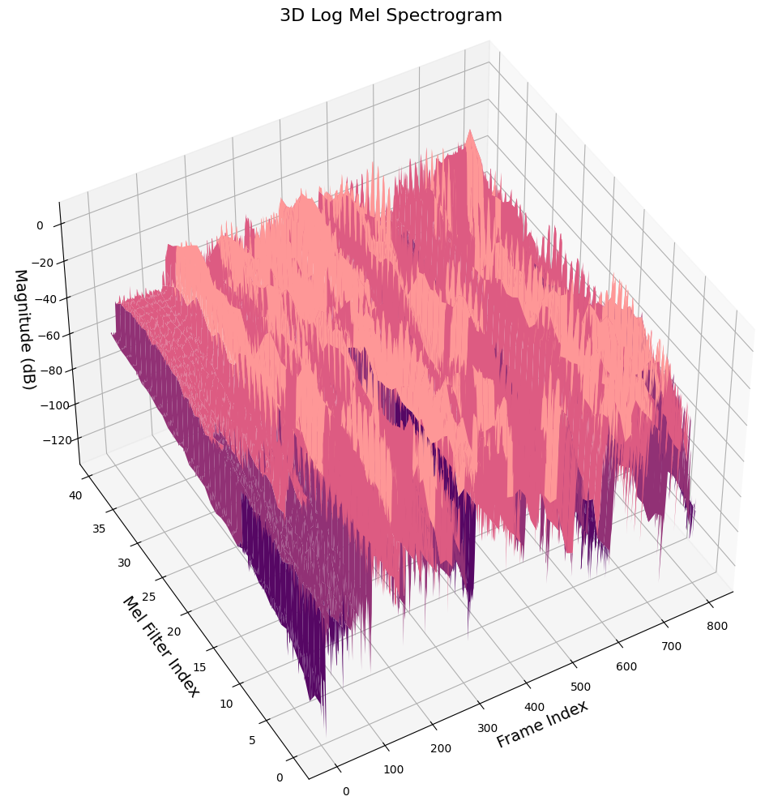
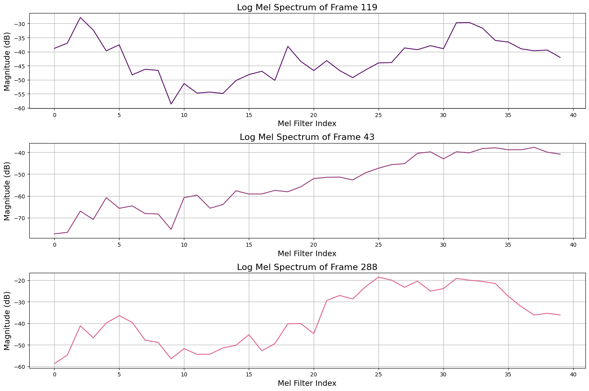
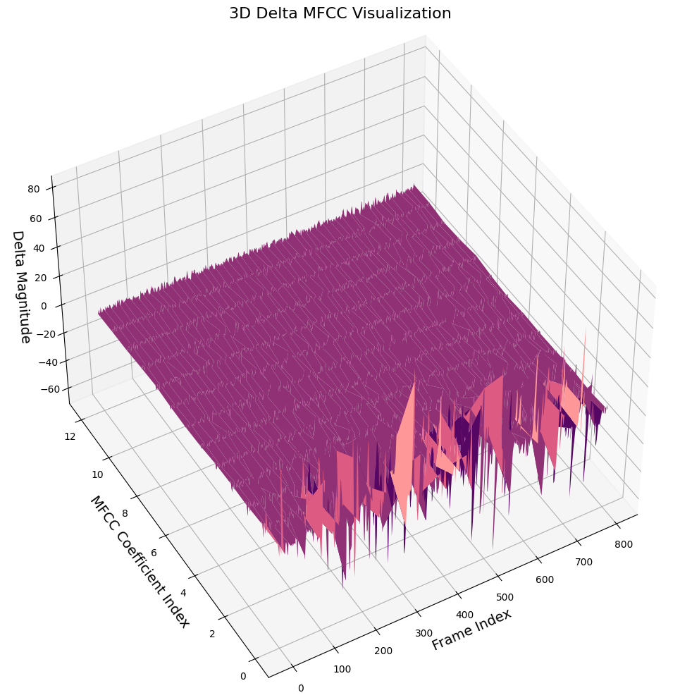
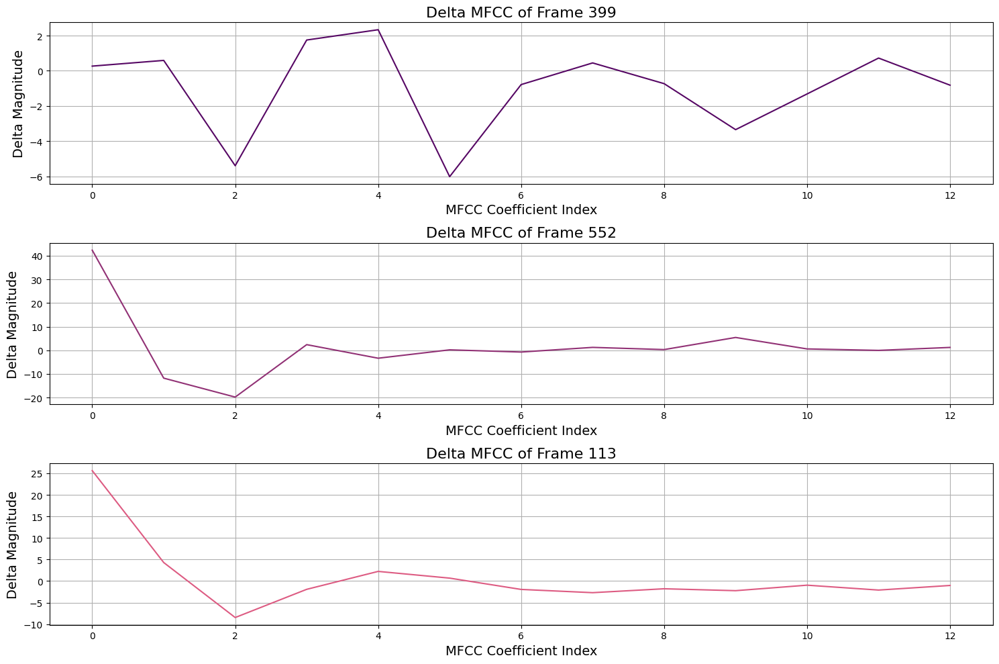
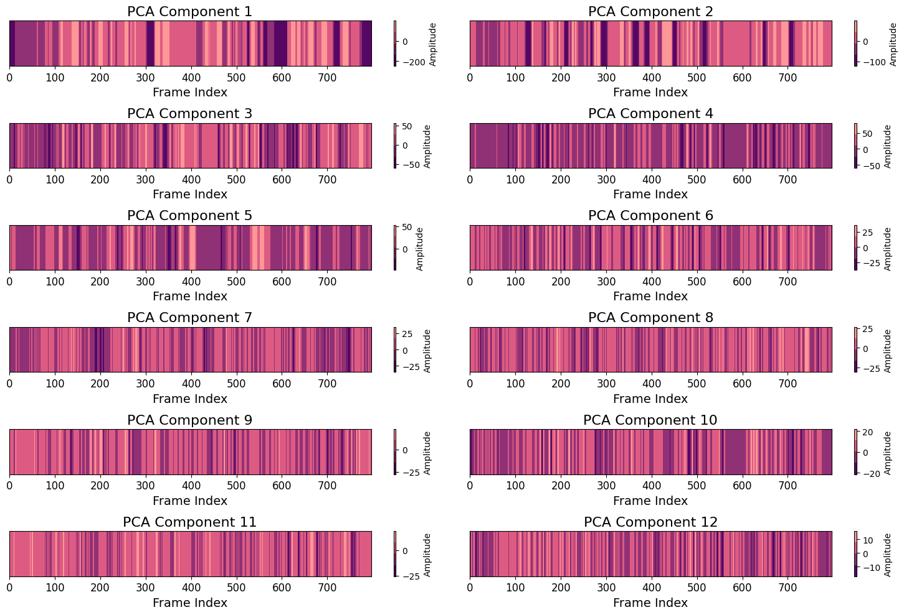
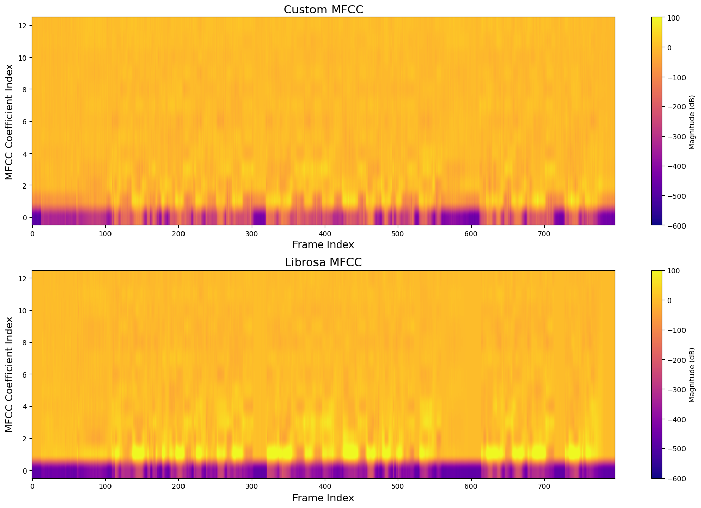

# Speech_Recognition_2022

Tongji University · Class of 2022 · School of Computer Science and Technology · Software Engineering · Machine Intelligence Direction · Speech Recognition Coursework

Teacher: Ying Shen

Semester of instruction: 2024-2025, autumn semester

# Task: MFCC Extraction

Extract acoustic features (MFCC) for a segment of speech. Comment your codes properly.

Processing steps include:

- Pre-emphasis
- Windowing
- STFT
- Mel-filter bank
- Log()
- DCT
- Dynamic feature extraction
- Feature transformation

Compare your results with the output of MFCC function provided by Python package. Give possible reasons for the difference in your report.

Upload your codes and report.

# Overview

This report explains the process of extracting MFCC (Mel Frequency Cepstral Coefficients) acoustic features from a segment of speech. We will discuss the following steps in sequence: pre-emphasis, windowing, Short-Time Fourier Transform (STFT), Mel-filter bank, logarithmic scaling, Discrete Cosine Transform (DCT), dynamic feature extraction, and feature transformation, along with relevant graphical outputs such as spectrograms and MFCC plots. By thoroughly analyzing the implementation and effects of each step, we will highlight the significance of MFCC extraction in speech processing and its potential impact in practical applications.

# Import Packages and Load Audio

In this section, we will import the necessary libraries and load the audio file for subsequent processing. The following are the specific steps:

1. Import the required libraries:

- `librosa`：Used for audio processing, including loading audio files and extracting features.
- `numpy`：Used for numerical computations and array operations.
- `matplotlib`：Used for data visualization, helping to display the waveform and spectrum of the audio signal.

2. Load the audio file: Use the `librosa.load()` function to load the specified audio file, which will return the audio signal and the sampling rate.


# Pre-emphasis

In the process of audio signal processing, pre-emphasis is an important signal enhancement technique aimed at amplifying the high-frequency components of the signal to compensate for potential high-frequency loss in subsequent processing steps.

In this experiment, pre-emphasis is implemented using the `pre_emphasis` function, which takes the input audio signal and a pre-emphasis coefficient (defaulting to 0.98) as parameters. The core idea of pre-emphasis is to apply a weighted difference between the current sample and the previous sample, with the formula as follows:
\[ 
\text{emphasized\_signal}[n] = \text{signal}[n] - \alpha \times \text{signal}[n-1] 
\]

In this formula, \(\alpha\) controls the degree of high-frequency enhancement. In this way, the high-frequency components of the signal are amplified, which helps capture spectral features more effectively during subsequent Short-Time Fourier Transform (STFT) and Mel-filter bank processing.

In the latter part of the code, the pre-emphasized signal is compared to the original signal. By visualizing the waveform and spectrum, it can be observed that the amplitude of the pre-emphasized signal is significantly increased in the high-frequency region, indicating that the pre-emphasis successfully enhanced the high-frequency components of the signal. Additionally, the code calculates and prints the mean and standard deviation of both the original and pre-emphasized signals to quantify their statistical properties.




# Windowing

In audio signal processing, windowing is a commonly used technique to divide continuous signals into overlapping frames for subsequent frequency domain analysis, such as Short-Time Fourier Transform (STFT). The primary purpose of the windowing function is to reduce spectral leakage caused by signal truncation, thereby improving the accuracy and resolution of frequency domain features.

1. **Frame Segmentation:** First, the input audio signal is divided into several overlapping frames. The length of each frame is determined by `frame_size` , while the time interval between two consecutive frames is controlled by `frame_stride` . This overlapping design ensures that important frequency information in the signal is not lost due to frame truncation.

2. **Window Function Selection:** In this code, the Hamming window is chosen as the windowing function. The Hamming window is a smooth window function that effectively reduces spectral leakage. Its mathematical expression is:

\[
w[n] = 0.54 - 0.46 \cdot \cos\left(\frac{2\pi n}{N-1}\right) \quad (0 \leq n < N)
\]


Where $N$ is the length of the window, and $n$ is the index of the current sample.

3. **Applying the Window Function:** By multiplying the window function with the signal in each frame, the windowed signal is obtained. The specific code implementation is as follows:

```pyhon
window = np.hamming(frame_length)
frames_windowed = frames * window
```

4. **Visualization and Comparison:** The code also visualizes the differences between the frame signals before and after applying the window function. By comparing the signals with and without windowing, it can be observed that the windowed signal has a smoother waveform, which helps reduce spectral leakage.
   


# Short-Time Fourier Transform (STFT)

In audio signal processing, Short-Time Fourier Transform (STFT) is a method used to analyze how the frequency spectrum of a signal changes over time. STFT achieves this by dividing the signal into small, overlapping time segments (frames) and then applying the Fourier Transform to each frame. This method captures both the time and frequency characteristics of the signal and is suitable for analyzing non-stationary signals such as speech and music.

1. **Computing the Magnitude Spectrum:** The `np.fft.rfft` function is used to perform the Fast Fourier Transform (FFT) on each frame, obtaining the magnitude spectrum of each frame. The magnitude spectrum represents the strength of the signal at different frequencies. The specific code is as follows:

```python
mag_frames = np.abs(np.fft.rfft(frames, NFFT))
```

2. **Computing the Power Spectrum:** The magnitude spectrum is squared and normalized to obtain the power spectrum. The power spectrum shows the energy distribution of frequency components, which helps in understanding the signal's energy characteristics:

```python
pow_frames = ((1.0 / NFFT) * (mag_frames ** 2))
```

3. **Frequency Resolution Setting:** The `NFFT` parameter determines the number of points for the Fourier Transform, thereby affecting the frequency resolution. A larger `NFFT` value will provide higher frequency resolution.

4. **Visualizing the Spectrum:** The code plots the magnitude spectrum and 3D spectrogram for randomly selected frames to visually present the spectral features of each frame. Each chart displays the signal strength at different frequencies, helping to analyze the signal's variations in both time and frequency domains.

5. **3D Spectrogram:** Finally, a 3D plot is used to display the STFT results of the entire signal. By converting the magnitude spectrum to a decibel (dB) scale, it becomes easier to observe how different frequency components change over time. This 3D visualization provides an intuitive way to understand the frequency content of the audio signal.





# Mel-filter Bank

In audio signal processing, the Mel Filter Bank is an important tool used to convert the spectrum to the Mel frequency scale, which better simulates how the human ear perceives sound. The Mel Filter Bank consists of several triangular filters, each weighing the input signal within a specific frequency range, thereby extracting frequency features related to human auditory perception.

1. **Mel Scale Conversion:** The code first converts the low and high frequencies to the Mel scale. The Mel scale is a logarithmic scale commonly used in audio processing to match the human ear's perception of frequency:

```python
low_freq_mel = 0
high_freq_mel = 2595 * np.log10(1 + (fs / 2) / 700)
```

2. **Generating Mel Points:** The Mel points are generated by evenly distributing them on the Mel scale and then converting them back to Hertz (Hz):

```python
mel_points = np.linspace(low_freq_mel, high_freq_mel, num_filters + 2)
hz_points = 700 * (10 ** (mel_points / 2595) - 1)
```
3. **Mapping FFT Frequencies to Filter Indices:** The corresponding FFT frequency points are computed to construct the filters later:

```python
bin_points = np.floor((NFFT + 1) * hz_points / fs)
```

4. **Building Triangular Filters:** A 2D array is created to represent the filter bank. Triangular filters are constructed between adjacent Mel points, as shown below:

```python
for m in range(1, num_filters + 1):
    f_m_minus = int(bin_points[m - 1])
    f_m = int(bin_points[m])
    f_m_plus = int(bin_points[m + 1])
    # Construct the left and right sides of the triangular filter
```

5. **Applying the Mel Filter Bank:** The Mel Filter Bank is applied to the spectrum, generating the Mel spectrum. The Mel spectrum reflects the energy distribution of the signal on the Mel frequency scale by weighting and summing each spectral feature:

```python
mel_spectrum = np.dot(spectrum, filters.T)
```

6. **Visualizing the Mel Filter Bank:** The code plots the response of the Mel Filter Bank, showing the shape of each filter in the frequency domain. This helps to understand how each filter weighs the input signal.

7. **3D Visualization:** A 3D plot is used to display the Mel spectrum and the response of the Mel Filter Bank, providing an intuitive representation of the Mel frequency features and time-domain variations in the audio signal.


# Log Transformation

In audio signal processing and feature extraction, logarithmic transformation (Log Transformation) is a commonly used method to simulate how the human auditory system perceives sound intensity. By applying a logarithmic transformation, the dynamic range of the audio signal can be compressed, making lower amplitude sounds easier to process and analyze.

1. **Defining the Logarithmic Transformation Function:** The `log_magnitude` function takes an input spectrum (e.g., the Mel spectrum) and converts it to a logarithmic scale. The implementation is as follows:

```python
return 10 * np.log10(x)
```
This function applies a base-10 logarithm to the input signal and converts it to a decibel (dB) scale. This transformation effectively compresses large amplitude differences, making smaller amplitude variations more noticeable.

2. **Applying the Logarithmic Transformation:** The logarithmic transformation is applied to the Mel spectrum, generating the log-Mel spectrum:

```python
log_mel_spectrum = log_magnitude(mel_spectrum)
```

3. **Visualizing the Log-Mel Spectrum:** The code uses 3D plots and 2D plots of random frames to display the log-Mel spectrum. The 3D plot visually presents how the intensity of each Mel filter changes over time and frequency. The visualization is implemented as follows:

```python
ax.plot_surface(time_mesh, mel_mesh, log_mel_spectrum_dB, cmap=custom_cmap, edgecolor='none')
```

4. **Plotting Random Frames:** The log-Mel spectrum of randomly selected frames is also plotted to observe the spectral characteristics of specific frames.

```python
plt.plot(log_mel_spectrum[frame_idx], color=custom_colors[i % len(custom_colors)])
```




# Discrete Cosine Transform (DCT)

In audio signal processing and feature extraction, the Discrete Cosine Transform (DCT) is an important tool often used to convert signals from the time domain or frequency domain into a more compact frequency domain representation. DCT plays a significant role in various applications, including speech recognition, audio encoding, and image compression.

1. **Computing DCT:** The `dct` function is used to apply the DCT transformation to the log-Mel spectrum. The implementation is as follows:

```python
mfcc_features = dct(log_mel_spectrum, type=2, axis=1, norm='ortho')[:, :13]
```
Here, `type=2` indicates a standard DCT transformation, `axis=1` specifies that the transformation is applied along the rows (each time frame), and `norm='ortho'` means orthogonal normalization is used. This operation converts each frame of the log-Mel spectrum into MFCC features, extracting its primary frequency components.

2. **Extracting MFCC Coefficients:** The code selects the first 13 coefficients of the DCT transformation, as these coefficients typically represent the signal's characteristics most effectively. The MFCC extraction step is as follows:

```python
mfcc_features = dct(log_mel_spectrum, type=2, axis=1, norm='ortho')[:, :13]
```

3. **Visualizing MFCC Features:** The code uses 3D plots to display the extracted MFCC features. In the 3D plot, the x-axis represents the frame index, the y-axis represents the MFCC coefficient index, and the z-axis shows the magnitude of each coefficient. This allows for a visual observation of how the MFCC features change over time and frequency:

```python
ax.plot_surface(time_mesh, mfcc_mesh, mfcc_features_3d, cmap=custom_cmap, edgecolor='none')
```

4. **Plotting Random Frames:** The MFCC features of randomly selected frames are plotted in 2D to facilitate the observation of feature behavior in specific frames. The relevant code for this part is as follows:

```python
plt.plot(mfcc_features[frame_idx], color=custom_colors[i % len(custom_colors)])
```


# Dynamic Feature Extraction

In audio signal processing and feature extraction, **Dynamic Feature Extraction** refers to calculating the temporal variations of audio features (such as MFCC) to capture the dynamic characteristics of the signal. These dynamic features typically include the first-order derivative (Delta) and second-order derivative (Delta-Delta), which reflect the changing trends of the features over time.

1. **Calculating the First-Order Derivative (Delta):** The delta function is used to compute the first-order derivative of the MFCC features, representing the temporal changes of each MFCC coefficient. The implementation is as follows:
```python
delta1 = delta(mfcc_features)
```
The calculation of the first-order derivative involves performing a weighted sum on the input feature matrix to evaluate the rate of change of the feature values. The $N$ parameter in the code specifies the window size for calculating the derivative.

2. **Calculating the Second-Order Derivative (Delta-Delta)**: After obtaining the first-order derivative, the second-order derivative (Delta-Delta) is computed to capture the acceleration of feature changes. This step is implemented by calling the delta function again:

```python
delta2 = delta(delta1)
```

3. **Visualizing the Dynamic Features:** The code uses 3D plots to display the first-order derivative (Delta MFCC) and second-order derivative (Delta-Delta MFCC). In the 3D plot, the x-axis represents the frame index, the y-axis represents the MFCC coefficient index, and the z-axis represents the magnitude of each coefficient. This visualization allows for intuitive observation of how the dynamic features change over time and frequency:

```python
ax.plot_surface(time_mesh, mfcc_mesh, delta1_3d, cmap=custom_cmap, edgecolor='none')
```

4. **Plotting Random Frames:** The dynamic features of randomly selected frames are plotted in 2D to facilitate the observation of dynamic behavior in specific frames:

```python
plt.plot(delta1[frame_idx], color=custom_colors[i % len(custom_colors)])
```





# Feature Transformation

In audio signal processing and feature extraction, Feature Transformation is a key step aimed at processing the extracted features to improve the model’s performance and stability. Feature transformation typically includes operations such as feature combination, mean normalization, and variance normalization.

1. **Feature Stacking:** The MFCC features, first-order derivative (Delta), and second-order derivative (Delta-Delta) are horizontally stacked together to form a new feature set. This step is implemented using the np.hstack function:

```python
stacked_features = np.hstack((mfcc_features, delta1, delta2))
```
By merging these three types of features, the model can more comprehensively capture the time-domain and frequency-domain characteristics of the audio signal.

2. **Mean Normalization:** The combined feature set is then mean normalized, where the mean of each feature across all frames is subtracted from the feature values. This process eliminates bias between different features, centering them close to zero. The formula is as follows:

```python
cmn_features = stacked_features - np.mean(stacked_features, axis=0)
```
Mean normalization helps improve the model’s training speed and convergence, preventing biases in certain features from affecting learning.

3. **Variance Normalization:** Next, variance normalization is applied to the mean-normalized features by dividing each feature by its standard deviation. The implementation is as follows:

```python
cvn_features = cmn_features / np.std(cmn_features, axis=0)
```
Variance normalization ensures that each feature has the same scale, causing the features to fluctuate within the same range (usually [-1, 1]). This is especially important for model training because features of different scales can reduce the efficiency of optimization algorithms.

4. **Visualizing Features:** The code uses 3D plots to display the normalized feature set. This plot shows the relationship between time frames and feature indices (MFCC, Delta, and Delta-Delta), allowing us to visually observe the changes in features:

```python
ax.plot_surface(time_mesh, feature_mesh, cvn_features_3d, cmap=custom_cmap, edgecolor='none')
```

5. **Printing Feature Information:** The code also outputs the shape of the normalized feature matrix and the feature values of a specific frame, which is helpful for analysis and debugging:

```python
print('CVN Features Shape:', cvn_features.shape)
```


# Principal Component Analysis (PCA)

**Principal Component Analysis (PCA)** is a commonly used dimensionality reduction technique that transforms high-dimensional data into a lower-dimensional space through linear transformation to capture the most important variability in the data. In the context of audio signal processing and feature extraction, PCA helps reduce the dimensionality of features while retaining most of the information, which is important for subsequent model training and analysis.

1. **Initializing PCA:** Use the PCA class to initialize a PCA model, setting the number of principal components to retain (n_components), which determines the number of feature dimensions to keep:

```python
pca = PCA(n_components=n_components)
```
2. **Fitting the PCA Model and Transforming Data:** By calling the fit_transform method, the PCA model fits the input feature set (such as the combined features of MFCC, Delta, and Delta-Delta) and returns the transformed feature data:

```python
transformed_features = pca.fit_transform(features)
```

3. **Visualizing PCA Components:** The code uses a heatmap to show the variation in each principal component. The magnitude of each PCA component is plotted, where the x-axis represents the frame index and the y-axis represents different principal components:

```python
plt.imshow(transformed_features[:, i].reshape(-1, 1).T, aspect='auto', cmap=custom_cmap, origin='lower')
```

4. **Explained Variance Ratio:** PCA provides the explained variance ratio for each principal component, indicating how much of the original data's variability each component captures. You can print the explained variance ratio of each principal component using the following code:

```python
explained_variance = pca_model.explained_variance_ratio_
```

5. **Printing PCA Component Feature Vectors:** The components_ attribute of the PCA model contains the feature vectors for each principal component, showing how the original feature space is combined to form new principal components:

```python
print(pca_model.components_)
```

6. **Printing Transformed Features of a Specific Frame:** The code also outputs the PCA-transformed features of a specific frame (e.g., frame 10), which is useful for analysis and debugging:

```python
print(transformed_features[frame_number])
```



# Comparison with `librosa` MFCC

In the process of audio signal processing and feature extraction, comparing a custom MFCC implementation with the MFCC features calculated using popular libraries like librosa is an important step. This comparison helps validate the accuracy and effectiveness of the custom implementation, ensuring that the extracted features are suitable for subsequent analysis and modeling.

1. **Calculating Hop Length:** The hop length is calculated based on the frame step size and the sampling rate. This value determines the interval between each frame.

2. **Calculating MFCC with librosa:** The librosa.feature.mfcc function is used to compute MFCC features directly from the raw signal. The function parameters include the sampling rate, the number of FFT points, hop length, and the number of Mel filters.

3. **Shape Matching:** To ensure that the custom MFCC features and the MFCC features calculated by librosa have consistent shapes, the code checks their shapes and trims or pads them as necessary. This process ensures that both feature sets have the same dimensions for comparison.

4. **Visualizing the Comparison:** A heatmap is used to visually compare the custom MFCC and librosa MFCC outputs. The x-axis represents the frame index, the y-axis represents the MFCC coefficients, and the color intensity represents the magnitude (in decibels).

5. **Result Analysis:** By analyzing the visual comparison, the similarities or differences between the custom MFCC and librosa MFCC in terms of magnitude, feature representation, and temporal changes can be observed. This helps assess the effectiveness of the custom implementation and determine if further adjustments or optimizations are needed.

